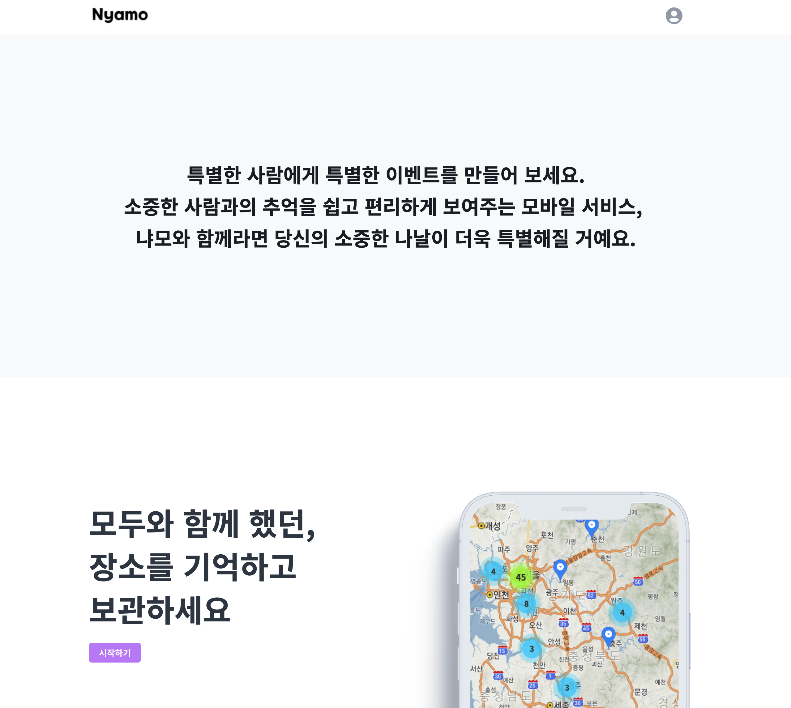
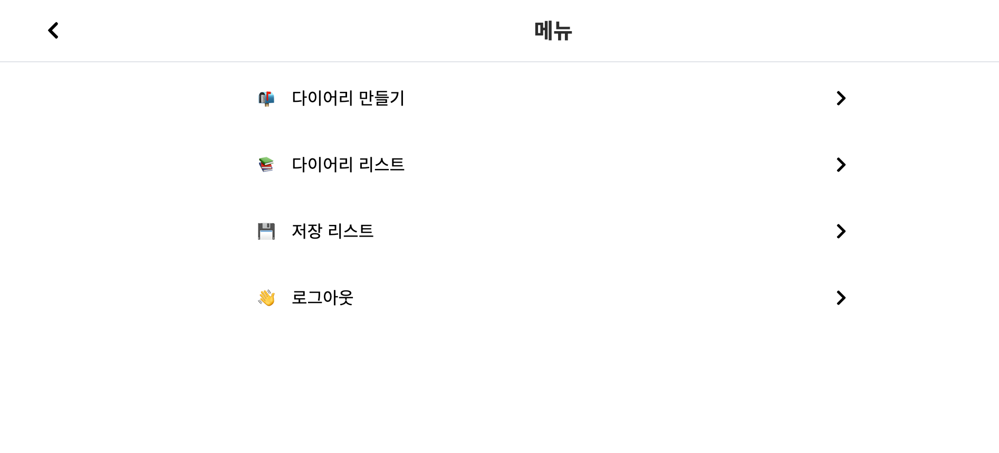
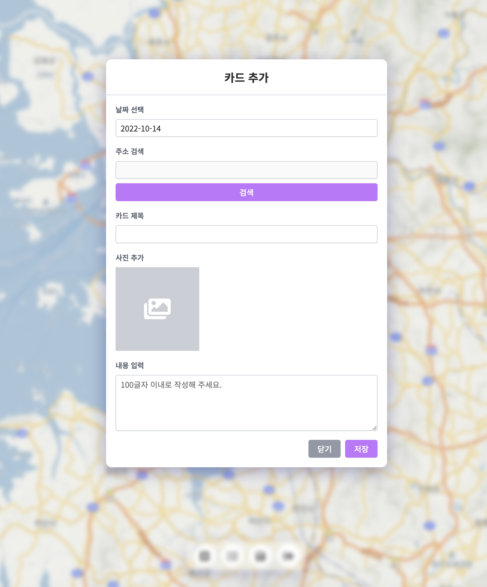

# couple_diary








## back .config 내용
```
HOST="host"
DATABASE="database"
DATABASE_TYPE="mysql+pymysql"
DBUSER="dbuser"
PASSWORD="password"
TOKEN_KEY="key"
Authorization="Bearer key"
IMAGE_ACCOUNT_ID="ACCOUNT_ID"
```


## front .env 내용
```
REACT_APP_API_URL=http://localhost:8000
```